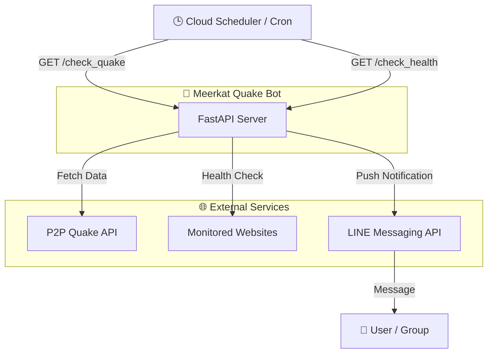

# 🦦 Meerkat Quake Bot (ミーアキャットの地震警備🦦)


地震情報の監視と通知、およびWEBサイトの死活監視を行うLINE Botです。
FastAPIで動作し、Cloud Scheduler等から定期実行されることを想定しています。


## 🚀 機能 (Features)

### 1. 🌏 地震速報 (Earthquake Notification)
P2P地震情報APIを監視し、新しい地震が発生した場合にLINEで通知します。
- **エンドポイント**: `/check_quake`
- **通知条件**:
  - 最大震度が **震度3以上** であること
  - 発生から **5分以内** であること
- **通知内容**: 発生時刻、震源地、最大震度、マグニチュード、津波情報

### 2. 🏥 サイト死活監視 (Website Health Check)
登録されたURLのステータスをチェックし、異常（ステータスコード200以外、またはタイムアウト）があった場合に警告を通知します。
- **エンドポイント**: `/check_health`
- **監視リスト**:
  - Google (接続確認用)
  - P2P地震情報API
  - ユーザー定義URL (環境変数で設定)

## 🛠️ セットアップ (Setup)

### 必須環境変数 (.env)
以下の変数を設定してください。

| 変数名 | 説明 |
| --- | --- |
| `LINE_CHANNEL_ACCESS_TOKEN` | LINE Messaging APIのアクセストークン |
| `TARGET_USER_ID` | 通知を送るLINEユーザーまたはグループのID |
| `URL_USAGI` | 監視対象URL 1 (🐰 うさぎ) |
| `URL_ROBO` | 監視対象URL 2 (🤖🐈 ロボ猫) |

### 起動方法
```bash
# 依存ライブラリのインストール
pip install -r requirements.txt

# ローカルサーバー起動
uvicorn main:app --reload
```

## 📂 構成
- `main.py`: アプリケーション本体
- `requirements.txt`: 依存ライブラリ
- `.env`: 環境変数設定ファイル（gitには含めないこと）

## 📐 アーキテクチャ (Architecture)



### 📸 通知サンプル (Notification Sample)
LINE通知のサンプル画像です。


## [地震通知サンプル](mock_notification.py)

## [監視通知サンプル](mock_health_check.py)

## 📄 ライセンス
MIT License
